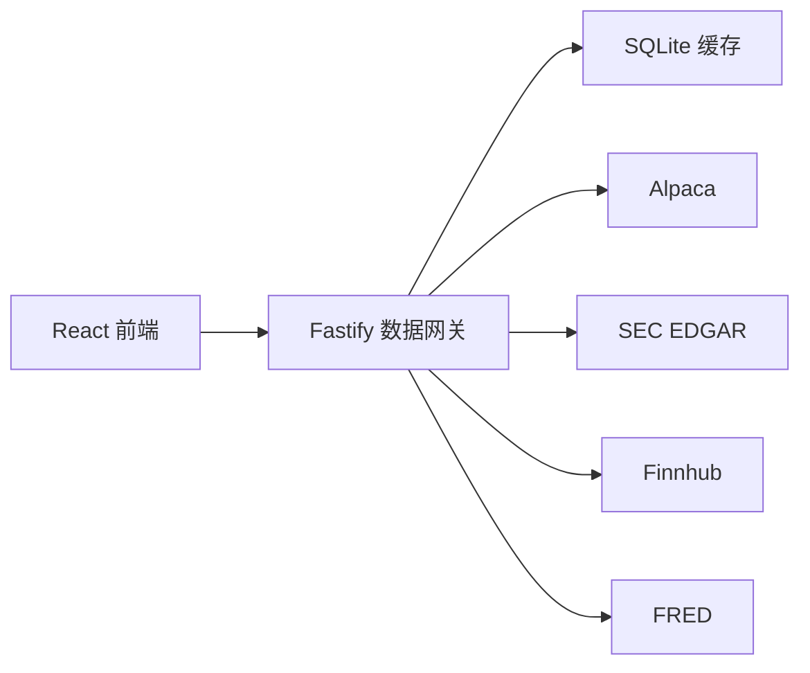
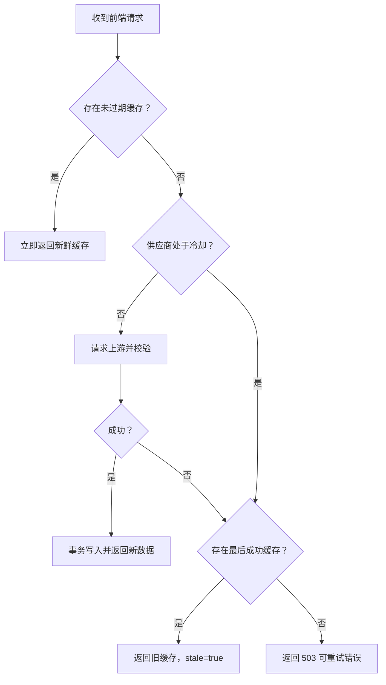

# stock_m 真实市场数据平台设计规格

日期：2026-08-07
状态：已确认，待实施计划

## 1. 目标

把当前基于确定性模拟数据的美股研究工作台升级为个人本地使用的真实数据产品，同时保留已有的发现、研究、自选、模拟交易、组合风控和周度复盘闭环。

本阶段使用免费额度优先的多数据源架构：

- Alpaca 提供美股与 ETF 的延迟报价、K 线、新闻和公司行动。
- SEC EDGAR 提供监管文件和 XBRL 财务数据。
- Finnhub 提供公司资料和财报日历。
- FRED 提供宏观指标、发布时间和历史数据。

浏览器只访问项目自己的 Node.js 数据网关。所有 API Key 均保留在服务端环境变量中，不进入浏览器包、本地存储、日志、Git 或错误响应。

## 2. 成功定义

完成后，用户可以：

1. 在“今日”页查看真实市场状态、指数、关注股票异动、财报和宏观事件。
2. 在约 100 只高流动性美股与 ETF 的默认股票池中使用真实数据筛选，并维护个人股票池。
3. 在自选页查看真实延迟报价、数据来源和更新时间。
4. 在研究页查看真实报价、K 线、公司资料、财务趋势、SEC 文件、新闻、财报日期和公司行动。
5. 使用真实延迟报价重估本地模拟持仓，同时继续使用现有不可变账本、风险提醒和周度复盘。
6. 在统一事件日历中查看财报、分红、拆股、FOMC、CPI、PCE、非农和 GDP 等事件。
7. 在上游服务不可用或免费额度耗尽时继续查看最后一次成功缓存，并清楚知道数据已经过期。

## 3. 使用场景与约束

- 目标用户是单个个人投资者，应用在本地运行，不面向公开或商业分发。
- 目标市场仅为美国上市股票与 ETF。
- 数据仅用于研究和模拟交易，不发送真实订单，不提供自动买卖建议。
- 行情默认使用 Alpaca Basic 可用的 IEX 或 15 分钟延迟 SIP 数据。
- 默认股票池约 100 个标的，不承诺扫描全部美股。
- 用户可以维护股票池；新标的首次加入时按需补齐资料、财务和事件。
- 金额保留原始币种。当前组合仍以 USD 计价，不在本阶段实现多币种换算。
- 缺失数据保持缺失，不转换为零，不根据其他字段臆造值。
- 所有时间在接口中使用 ISO 8601；界面按用户本地时区显示，并标出市场时区语义。
- Node.js 最低版本为 22。
- 继续使用简体中文界面，并保持现有 1440、1280 和 1024 px 桌面布局目标。

## 4. 非目标

本阶段不包含：

- 券商账户、真实订单、资金划转或账户持仓同步。
- 登录、云端账户、多设备同步和多租户。
- 全市场实时扫描、逐笔成交、Level 2、期权、期货、外汇和加密资产。
- 付费行情订阅和商业数据授权。
- 新闻全文再发布、自动新闻摘要、情绪交易信号或 AI 投资建议。
- 自动补仓、止损、调仓或事件触发交易。
- 后台常驻的大规模数据仓库、消息队列或分布式任务系统。
- 把模拟数据静默混入真实数据。

## 5. 总体架构



新增独立的 `server/` Node.js 数据网关。前端仅调用 `/api/*`，不直接解析供应商响应。网关按领域定义稳定接口，供应商适配器负责认证、请求、分页、限额识别和标准化。

网关采用：

- TypeScript：前后端共享稳定领域类型。
- Fastify：HTTP 路由、插件和可注入的集成测试。
- Zod：查询参数、环境变量和供应商响应边界校验。
- SQLite：最后成功响应、过期时间、同步状态和供应商冷却状态。

供应商原始类型只存在于 `server/providers/`。React 页面不得导入供应商类型或 API 客户端。

## 6. 模块边界

| 模块 | 职责 | 依赖 |
| --- | --- | --- |
| `MarketDataProvider` | 报价、批量快照、分钟线、日线和市场状态 | Alpaca |
| `CompanyDataProvider` | 公司名称、交易所、行业、市值、描述和标识符 | Finnhub、SEC 元数据 |
| `FundamentalsProvider` | 标准化三张报表、XBRL 指标和申报文件 | SEC EDGAR |
| `EventDataProvider` | 财报日历、公司行动、宏观发布日历 | Finnhub、Alpaca、FRED |
| `NewsProvider` | 公司新闻标题、摘要、来源、时间和原文链接 | Alpaca |
| `MarketDataCache` | 缓存读写、过期判断、最后成功数据和供应商冷却 | SQLite |
| `MarketDataGateway` | 读取缓存、调用适配器、降级和构造统一响应 | 上述模块 |
| `MarketApiClient` | 前端调用项目 API，解析统一响应 | `/api/*` |

每个模块必须可以通过接口替换。新增或替换供应商时，页面和组合计算不应改变。

## 7. 统一响应与领域类型

所有数据接口返回统一信封：

```ts
type ProviderSource = "alpaca" | "sec" | "finnhub" | "fred";
type DataSource = ProviderSource | "composite";

interface DataEnvelope<T> {
  data: T;
  source: DataSource;
  asOf: string;
  fetchedAt: string;
  expiresAt: string;
  stale: boolean;
  delayMinutes?: number;
  notices: string[];
}
```

规则：

- `asOf` 是数据本身代表的时间。
- `fetchedAt` 是网关最后成功取得该数据的时间。
- `expiresAt` 是重新请求上游的最早时间。
- `stale` 仅表示当前时间已超过 `expiresAt`，不能用来推断数据错误。
- `delayMinutes` 仅在供应商明确给出或数据产品固定延迟时设置。
- `notices` 包含延迟、旧缓存、部分字段缺失和供应商限制等用户可读说明。
- 合并多个供应商的响应使用 `source: "composite"`；每个子项继续保留自己的 `ProviderSource`。
- 不允许用当前请求时间代替未知的 `asOf`。

关键领域对象至少包含：

```ts
interface MarketQuote {
  symbol: string;
  price?: number;
  previousClose?: number;
  change?: number;
  changePercent?: number;
  bid?: number;
  ask?: number;
  volume?: number;
  currency: string;
  marketSession: "pre" | "regular" | "after" | "closed" | "unknown";
}

interface PriceBar {
  symbol: string;
  startedAt: string;
  open: number;
  high: number;
  low: number;
  close: number;
  volume?: number;
  adjusted: boolean;
}

interface CompanyProfile {
  symbol: string;
  name: string;
  exchange?: string;
  industry?: string;
  sector?: string;
  description?: string;
  website?: string;
  logoUrl?: string;
  marketCapitalization?: number;
  currency?: string;
  cik?: string;
}

interface FinancialFact {
  symbol: string;
  statement: "income" | "balance-sheet" | "cash-flow";
  concept: string;
  label: string;
  value: number;
  unit: string;
  periodStart?: string;
  periodEnd: string;
  fiscalYear?: number;
  fiscalPeriod?: string;
  form: string;
  filedAt: string;
  accessionNumber: string;
}

interface MarketEvent {
  id: string;
  type: "earnings" | "dividend" | "split" | "corporate-action" | "macro";
  symbol?: string;
  title: string;
  scheduledAt: string;
  timing: "before-market" | "during-market" | "after-market" | "all-day" | "unknown";
  source: ProviderSource;
  sourceUrl?: string;
}

interface CompanyNewsItem {
  id: string;
  symbols: string[];
  headline: string;
  summary?: string;
  sourceName: string;
  publishedAt: string;
  url: string;
  imageUrl?: string;
}
```

## 8. 数据源职责

### 8.1 Alpaca

- 批量最新交易或快照。
- IEX 实时或 15 分钟延迟 SIP 报价。
- 分钟线和日线。
- 公司新闻元数据与原文链接。
- 分红、拆股、合并、名称变更等公司行动。

网关必须保留实际 feed 信息，并据此设置延迟说明。不得把 IEX 单交易所数据表述为全市场实时行情。

### 8.2 SEC EDGAR

- ticker 与 CIK 映射。
- submissions 文件历史。
- companyfacts XBRL 数据。
- 10-K、10-Q、8-K 及其修订文件链接。

请求必须发送可识别的 `SEC_USER_AGENT`。财务事实保留 SEC 的原始 concept、单位、报告期、表单、申报日期和 accession number。标准化展示层可以把多个 XBRL concept 映射到同一业务指标，但必须保留来源，且不能跨单位相加。

### 8.3 Finnhub

- 公司资料补充。
- 财报日历。

Finnhub 免费档仅用于个人用途。网关必须限制调用频率并缓存结果。若字段与 SEC 冲突，监管申报元数据以 SEC 为准，公司描述、网站和 logo 等展示字段以 Finnhub 为准。

### 8.4 FRED

- 宏观指标历史值。
- 宏观 release 与 release date。
- 首批指标：联邦基金利率、CPI、核心 CPI、PCE、核心 PCE、非农就业、失业率和实际 GDP。

界面必须展示声明：“本产品使用 FRED API，但未经圣路易斯联储认可或认证。”并链接 FRED 使用条款。

## 9. 股票池与数据预热

默认股票池约 100 个标的，覆盖：

- 大型科技与半导体。
- 金融、医疗、消费、工业、能源和公用事业代表公司。
- SPY、QQQ、DIA、IWM 及主要行业 ETF。

默认清单保存在版本化静态配置中。用户增删操作继续保存在本地个人状态中。前端把最终 symbol 集合发送给批量接口，网关不维护账户或用户身份。

预热采用有界并发：

1. 首先获取批量报价，使发现页尽快可用。
2. 再读取已有 SQLite 财务和资料缓存。
3. 对缺失或过期标的排队补齐公司资料、财务和事件。
4. 页面显示“数据准备中”的标的，不将其错误地从筛选结果中排除。

本阶段不实现全市场股票主数据同步。用户加入不受支持或不存在的 symbol 时，返回明确错误且不写入股票池。

免费数据可稳定计算的筛选指标包括价格、涨跌幅、营收与 EPS 同比、毛利率变化、自由现金流、自由现金流收益率、净债务/EBITDA、财报超预期、距 20 日高点、相对成交量、20 日平均成交额、市值、经营利润率、三个月回报和历史 beta。行业毛利率中位数由当前股票池二次计算。

远期 PE、相对行业远期 PE、PEG 和未来年度 EPS 修正依赖稳定的分析师预期数据，本阶段保持缺失并标记“当前免费数据源不支持”。默认筛选模板只使用可计算指标；历史保存的含不支持指标筛选仍可读取，但不会把缺失值当作零或匹配。

## 10. 缓存与刷新策略

| 数据类型 | 新鲜期 |
| --- | ---: |
| 报价 | 60 秒 |
| 分钟 K 线 | 60 秒 |
| 日线 | 15 分钟 |
| 新闻 | 10 分钟 |
| 财报日历 | 6 小时 |
| 公司行动 | 6 小时 |
| 公司资料 | 24 小时 |
| SEC 文件列表 | 24 小时 |
| 宏观数据与日历 | 24 小时 |
| 已申报历史财务事实 | 检测到新文件前复用 |

页面进入时自动请求，用户可以手动刷新。手动刷新绕过新鲜期读取，但仍遵守供应商冷却和频率限制，不删除最后成功缓存。

缓存键由领域、symbol、查询参数和数据版本组成。写入过程使用事务：

1. 校验供应商响应。
2. 标准化为领域对象。
3. 在同一事务中写入数据、`fetchedAt`、`expiresAt` 和来源元数据。
4. 成功提交后才替换旧缓存。

解析失败、请求失败或写入失败均不得覆盖最后成功缓存。

## 11. 请求与降级流程



不自动回退到模拟数据。模拟响应只用于测试夹具和显式演示模式。

## 12. API 设计

首批路由：

- `GET /api/health`
- `GET /api/market/status`
- `GET /api/market/quotes?symbols=AAPL,MSFT`
- `GET /api/market/bars/:symbol?timeframe=1Day&start=...&end=...`
- `GET /api/companies/:symbol`
- `GET /api/companies/:symbol/financials`
- `GET /api/companies/:symbol/filings`
- `GET /api/companies/:symbol/news`
- `GET /api/events?from=...&to=...&symbols=...`
- `GET /api/macro/series?ids=...`
- `POST /api/cache/refresh`，请求体只允许受支持的领域和 symbol

批量 symbol 参数：

- 转换为大写并去重。
- 单次最多 100 个。
- 仅允许字母、数字、点和连字符。
- 超过上限返回 400，不静默截断。

`/api/health` 只返回：

- 供应商是否配置。
- 最近成功请求时间。
- 是否处于冷却。
- SQLite 是否可写。
- 各数据域缓存数量和最旧更新时间。

## 13. 页面变更

### 13.1 今日

- 市场开闭状态和数据延迟说明。
- SPY、QQQ、DIA、IWM 快照。
- 自选和持仓异动。
- 七天内财报与宏观事件。
- 页面级刷新与各模块更新时间。

### 13.2 发现

- 默认真实股票池及用户自定义股票池。
- 用真实报价和缓存财务数据运行现有筛选规则。
- 默认模板调整为“高质量成长”“现金流价值”“财报改善”和“放量突破”，只使用当前免费数据能够稳定计算的指标。
- 对尚未准备好筛选字段的标的显示“数据准备中”。
- 筛选结果显示数据覆盖率，避免把缺失值解释为不满足条件。

### 13.3 自选

- 批量延迟报价、涨跌幅、成交量和市场阶段。
- 每行显示最新数据时间。
- 旧缓存、未配置和无报价使用不同文字状态。

### 13.4 研究

- 报价与多周期 K 线。
- 公司资料和数据来源。
- 收入、利润、现金流和资产负债趋势。
- 10-K、10-Q、8-K 文件列表和 SEC 原文链接。
- 公司新闻、财报日期、分红和拆股。
- 保留现有投资逻辑版本、同业比较和模拟买入流程。

### 13.5 组合与复盘

- 使用统一报价接口重估模拟持仓。
- 缺少某一持仓报价时继续遵守现有“估值不可用”规则。
- 快照记录实际使用的报价时间、来源和过期状态。
- 旧数据可以触发“市场数据已过期”信息提醒，但不产生买卖建议。

### 13.6 事件日历

- 合并财报、公司行动和宏观事件。
- 支持类型、日期和股票筛选。
- 股票事件跳转研究页；宏观事件跳转宏观详情。
- 对只有日期、没有精确时间的事件使用全天语义，不伪造时刻。

## 14. 配置与安全

服务端环境变量：

```dotenv
ALPACA_API_KEY_ID=
ALPACA_API_SECRET_KEY=
FINNHUB_API_KEY=
FRED_API_KEY=
SEC_USER_AGENT=stock_m contact@example.com
```

规则：

- `.env` 和本地 SQLite 文件加入 `.gitignore`。
- `.env.example` 只包含字段名、申请地址和说明。
- 日志过滤认证头、查询字符串中的 token 和环境变量值。
- 错误响应只包含内部错误码、用户可读消息和是否可重试。
- 前端构建产物不得包含上述 Key 名对应的值。
- 网关默认仅监听 `127.0.0.1`。
- 本阶段不增加跨域公开访问；Vite 开发服务器通过代理访问网关。

## 15. 错误处理

| 情况 | 行为 |
| --- | --- |
| 非法参数 | 400，指出字段和约束 |
| 不存在或不支持的 symbol | 404，不写入股票池 |
| 缺少供应商配置 | 有缓存则返回旧缓存；无缓存返回 503 `PROVIDER_NOT_CONFIGURED` |
| 上游 429 | 读取 `Retry-After`，进入供应商冷却；有缓存则返回旧缓存 |
| 上游超时或 5xx | 仅重试一次；失败后返回旧缓存或 503 |
| 响应结构不合法 | 记录结构校验错误，不覆盖缓存 |
| SQLite 不可写 | 返回现有内存读取结果；新数据不宣称已缓存 |
| 部分数据域失败 | 返回已成功的数据域，失败模块显示局部错误 |

单次上游请求超时为 8 秒。仅网络错误、超时和 5xx 可重试一次；400、401、403、404 和结构校验错误不重试。

## 16. 测试策略

### 16.1 供应商适配器

- 使用保存的最小官方响应夹具，不在默认测试中访问网络。
- 验证认证头、查询参数、分页和限额响应。
- 验证缺失字段、时间戳、币种、单位和 symbol 标准化。
- 验证 SEC concept 映射保留来源事实。
- 供应商响应结构发生变化时测试必须失败，而不是返回半解析对象。

### 16.2 网关集成

使用 Fastify `inject` 和临时 SQLite：

- 新鲜缓存命中不请求上游。
- 过期缓存触发上游刷新。
- 成功响应原子替换旧缓存。
- 429、超时、5xx 和无效响应返回最后成功缓存。
- 没有缓存时返回可重试 503。
- 未配置 Key 不泄露环境变量。
- 一个供应商失败不阻塞其他路由。

### 16.3 前端交互

- 加载、新鲜、旧缓存、未配置、无数据和错误状态。
- 页面与行级数据时间和延迟标识。
- 用户维护股票池和新增 symbol 校验。
- 研究页各数据模块独立加载和失败。
- 组合使用真实报价重估且缺失价格不变为零。
- 键盘可操作刷新、筛选、标签、表格和事件入口。

### 16.4 Chrome 端到端

默认 E2E 启动可控的测试网关，使用固定供应商夹具，覆盖：

1. 在真实股票池筛选 NVDA。
2. 打开研究页并查看报价、财务、SEC 文件和新闻。
3. 加入自选并看到批量报价。
4. 保存投资逻辑并模拟买入。
5. 组合按统一报价重估。
6. 在事件日历打开 NVDA 财报事件。
7. 模拟供应商失败并确认旧缓存提示。

另提供 `npm run test:data:smoke`。该命令仅在用户配置真实 Key 后运行，检查认证、基础响应和数据时间，不进入 CI，也不对市场价格做固定值断言。

## 17. 实施里程碑

### 17.1 里程碑一：核心数据底座

- Fastify 网关、环境配置、统一响应、SQLite 缓存和健康检查。
- Alpaca 行情与 K 线。
- SEC 公司映射、财务事实和文件。
- Finnhub 公司资料与财报日历。
- 默认股票池和数据预热。
- 今日、发现、自选、研究和组合的核心数据接入。

### 17.2 里程碑二：事件与资讯

- Alpaca 新闻和公司行动。
- FRED 宏观指标与发布日历。
- 统一事件日历。
- 研究页新闻与公司行动。
- 旧缓存降级、数据状态可视化和真实连接 smoke test。

两个里程碑必须分别可构建、可测试、可提交。里程碑一不依赖里程碑二才能正常使用。

## 18. 验收标准

- 前端生产路径不直接读取模拟行情。
- API Key 不进入浏览器、日志、Git 或错误响应。
- 任意行情均显示来源、数据时间和延迟状态。
- 默认股票池在缓存预热后可以使用真实数据筛选。
- 财务事实保留币种、单位、报告期、表单和 SEC 来源。
- 缺失字段不补零；未知时间不使用请求时间伪造。
- 有旧缓存时供应商故障不阻断阅读，且界面明确标记过期。
- 无缓存时显示局部可重试错误，不使整个页面崩溃。
- 组合重估继续遵守现有缺失价格规则。
- 单元、网关集成、前端交互、TypeScript 构建和 Chrome E2E 全部通过。
- README 完整说明免费 Key 申请、环境变量、启动、缓存、刷新和限额。

## 19. 官方资料

- [Alpaca Market Data API](https://docs.alpaca.markets/us/docs/about-market-data-api)
- [Alpaca Corporate Actions](https://docs.alpaca.markets/us/reference/corporateactions-1)
- [Alpaca Historical News](https://docs.alpaca.markets/us/docs/historical-news-data)
- [SEC EDGAR APIs](https://www.sec.gov/search-filings/edgar-application-programming-interfaces)
- [Finnhub Pricing](https://finnhub.io/pricing)
- [FRED API Overview](https://fred.stlouisfed.org/docs/api/fred/overview.html)
- [FRED API Terms](https://fred.stlouisfed.org/docs/api/terms_of_use.html)
